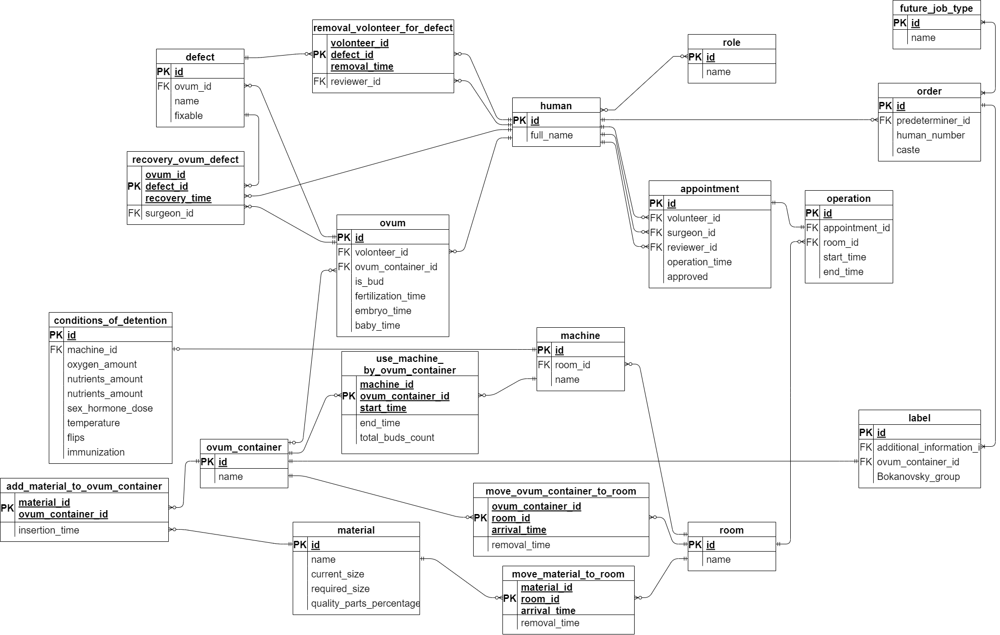

# Курсовая работа по Информационным системам и базам данных

<h4>Текст задания: </h4>

<h5>Требования к ER-модели и БД: </h5>

1. ER-модель должна соответствовать представленному описанию предметной области.

2. ER-модель базы данных должна включать в себя не менее 10 сущностей, содержать
хотя бы одно отношение «многие-ко-многим».

3. В качестве СУБД должна использоваться СУБД PostgreSQL. Для реализации БД и
вспомогательных средств должны использоваться языки SQL и PL/pgSQL База данных
должна быть развернута на сервере helios.

4. Веб-приложение, использующее разработанную базу данных, должно быть развернуто
на сервере helios.

5. Взаимодействие с БД/запуски запросов и скриптов должны осуществляться через psql.

<h5>Этап 1</h5>

* Выбрать предметную область для дальнейшего построения базы данных и вебприложения.
* Согласовать предметную область с преподавателем.
* Сделать подробное описание предметной области.

<h5>Этап 2</h5>

* Нарисовать ER-диаграмму предметной области. ER-модель должна соответствовать
описанию, представленному в рамках первого этапа курсовой работы.
* На основе ER-модели построить даталогическую модель.

<h5>Этап 3</h5>

Реализовать даталогическую модель в реляционной СУБД PostgreSQL:
* Создать необходимые объекты базы данных.
* Заполнить созданные таблицы тестовыми данными.
* Сделать скрипты для:
    * создания/удаления объектов базы данных;
    * заполнения/удаления созданных таблиц.
* Обеспечить целостность данных при помощи средств языка DDL.
* Добавить в базу данных триггеры для обеспечения комплексных ограничений
целостности.
* Реализовать функции и процедуры на основе описания бизнес-процессов (из этапа
№1).
* Произвести анализ использования созданной базы данных:
    * выявить наиболее часто используемые запросы к объектам базы данных;
    * результаты представить в виде текстового описания. 
* Создать индексы и доказать, что они полезны для вашей базы данных:
    * доказательство должно быть приведено в виде текстового описания.

<h5>Этап 4</h5>

* Использовать разработанную базу данных в качестве уровня хранения вебприложения.
* Приложение должно реализовывать бизнес-процессы (или их часть — по
согласованию с преподавателем), описанные в рамках первого этапа кр.
* Технологическая основа приложения согласовывается с преподавателем (до
реализации приложения).

<h4>Выполнение: </h4>
<h5>Этап 1</h5>

<b>Тема: Фабрика производства людей по произведению
«О дивный новый мир» О. Хаксли</b>

«О дивный новый мир»:
Действие романа разворачивается в Лондоне далёкого будущего (в 26 веке нашей эры, а именно в 2541 году). Люди на всей Земле живут в едином «прогрессирующем» государстве, где возведены в основу следующие ценности: беззаботность (работа не принята во внимание по причине естественного желания ей заниматься), сексуальная свобода и потребление.
Согласно сюжету, люди не рождаются естественным путём, а выращиваются в бутылях на специальных заводах — инкубаториях. На стадии развития эмбриона они разделяются на пять каст, различающихся умственными и физическими способностями — от «альф», обладающих максимальным развитием, до наиболее примитивных «эпсилонов». Дети с момента зачатия готовятся к тем видам труда, который должны будут выполнять.

<h5>Описание предметной области:</h5>
1. Предопределитель делает запрос на партию людей определённой касты
2. В зале оплодотворения запускаются оплодотворители
3. Добровольцы записываются на операцию по вырезанию яичника
4. На операцию записываются добровольцы, указывая время и персональные данные
    1. Если яйцеклетка добровольца не имеет дефектов, запись утверждается
    2. Если доброволец не проходит, запись не утверждается
5. Добровольцам проводят операцию в выбранное время
6. Яйцеклетки проверяются на дефекты 
    1. Если яйцеклетка дефективная, добровольца отстраняют на 35 дней
    2. Если дефекты поправимы, то яйцеклетку восстанавливают до пригодного состояния
        1. Если не удалось восстановить яйцеклетку, её утилизируют
    3. Если дефекты неисправимы, яйцеклетка утилизируется
 
7. Яйцеклетки помещаются в яйцеприёмник
8. Яйцеприёмник помещается в бульон со сперматозоидами
9. После оплодотворения яйцеприёмник вынимают из бульона
10. Если заказ на касты Альфа или Бета, то оплодотворённые яйцеклетки оставляют
11. Если заказ на касты Гаммы, Дельты или Эпсилоны, то оплодотворённые яйцеклетки обрабатываются по методу Бокановского:
    1. Яйцеклетки обрабатывают рентгеновским излучением (часть клеток гибнет, часть делится до x8 почек) - длится 8 минут
    2. Яйцеклетки оставляют на двое суток в инкубаторе
    3. Яйцеклетки охлаждают (они делятся до x8)
    4. Яйцеклетки глушат спиртом (они снова делятся до x8)
12. Яйцеклетки помещают в Укупорочный зал в бутыли
13. В Органохранилище поставляются свежие свиные туши
    1. Если свиная туша полностью некачественная, то её утилизируют
    2. Если свиная туша некачественная частично, то из качественных частей вырезают лоскуты определённого размера, а оставшиеся утилизируют
    3. Если качественной части свиной туши не хватает на лоскуты определённого размера, её утилизируют
    4. Если свиная туша полностью качественная, то её полностью нарезают на лоскуты определённого размера
14. Лоскуты доставляются в Укупорочный зал
15. В бутыли помещают лоскут свежей свиной брюшины
16. На бутыль наклеивают этикетку со сведениями о наследственности, дате оплодотворения, группе Бокановского
17. Бутыли отправляются в Зал социального предопределения, где на пробирку наносят дополнительные сведения в зависимости от заказа
18. В зависимости от запроса Предопределителя каждую бутыль определяют на один из пятнадцати конвейеров
19. Дорожка определяет дозу полового гормона, способность давать потомство, будущие умственные и физические способности.
20. Бутыли отправляются в Эмбрионарий на 267 суток
21. В зависимости от требуемой профессии подбирается нужное количество кислорода, температура, питательные вещества.
    1. Если нужно привить любовь к теплу, то плод отправляется на конвейер, где высокие температуры чередуются с низкими
    2. Если нужно развить вестибулярный аппарат, то плод отправляется на конвейер с переворотами
    3. Если нужно сделать устойчивым болезням, то плод иммунизируется 
22. Младенцев отдают в Младопитомник

<h5>Этап 2</h5>

Инфорологическая модель:

Даталогическая модель:

<h5>Этап 3</h5>

Скрипты для создания, удаления таблиц, триггеров, функций, индексов:
[тут](./db/scripts).

<h5>Этап 4</h5>
[тут](.).

# Лабораторная работа по Рефакторингу баз данных и приложений

<h3>Итерации рефакторинга:</h3>

* Проект “Фабрика по производству людей”
    * Первая итерация
        * Исправить REST API
            * Backend
                * Изменить типы и url запросов согласно принципам REST
                * Вынести DTO в отдельные сущности
            * Frontend
                * Согласовать axios запросы с исправленным backend
    * Вторая итерация
        * Backend
            * Исправить процесс отлавливания и обработки ошибок Spring REST MVC
            * Убрать try/catch блоки из контроллеров и сервисов
            * Добавить ResponseEntityExceptionHandler для обработки ошибок и формирования ответа
        * Frontend
            * Изменить клиентскую обработку респонсов с ошибками
            * Добавить парсинг передаваемых с бэкенда сообщений ошибок в сообщения для вывода пользователю
    * Третья итерация
        * Cleanup кода
        * Унификация методов сервисов (например, грамотное выкидывание DataNotFound для всех сущностей)
        * Рефакторинг репозиториев (удаление излишних методов, модификация JPQL запросов)
        * Декомпозиция классов и методов (например, вынесение сущностей DTO из контроллеров, вынос однотипного кода и
          прочее)
        * Добавление необходимых транзакций

<h3>Итерация 1:</h3>

* Ссылка на
  отчёт: [тык](https://docs.google.com/document/d/1Do4NQpC7SSb7K8Ntss9HTSx7_OP7YyInVO_l_bYcFMM/edit?usp=sharing).
* Ссылка на видео: [тык](https://drive.google.com/file/d/1lLAwqj79Q5328CqRCxr6rjJuGFEL7T89/view?usp=share_link).